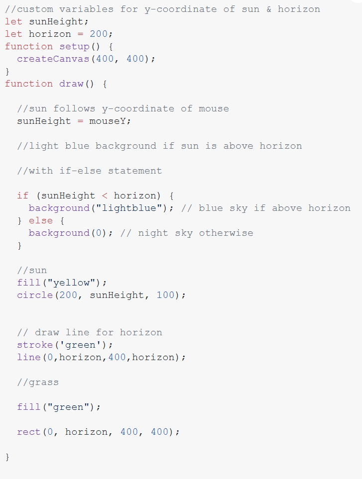
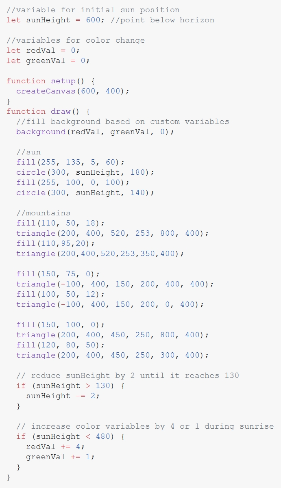

# wzha0973_9103_tut1_Quiz8

## Part 1

*The sketch shows the automatic movement of the sun, which is achieved by lowering its vertical position each time the 'draw()' function runs. This movement stops when the condition in the if statement becomes false, specifically when 'sunHeight' is 130 or less.*

*By learning to control and change variables over time, I can create detailed visual stories that respond to user interactions or changes in the environment. For example, I might design a scene where the background color shifts based on the time of day or user input, or where elements move in response to mouse actions, making the experience more engaging.*

## Part 2

[Link of Coding Technique A](https://editor.p5js.org/gbenedis@gmail.com/sketches/nNVmHVf5m/)

[Link of Coding Technique B](https://editor.p5js.org/gbenedis@gmail.com/sketches/IHAcGOxNz/)

*The code links the sun's vertical position to the mouse's Y-coordinate, enabling real-time adjustments. Background colors shift between black and light blue based on the sun's height, while conditional statements manage the landscape colors. The sunrise simulation is achieved by gradually lowering the sun and dynamically adjusting the background colors.*

*I can apply these techniques in my assignments by connecting mouse movement to create interactive experiences. Using conditional logic, I can change colors or shapes to simulate different times of day or weather. By layering shapes, I can add depth, such as creating an interactive day-night cycle that changes colors and lighting.*