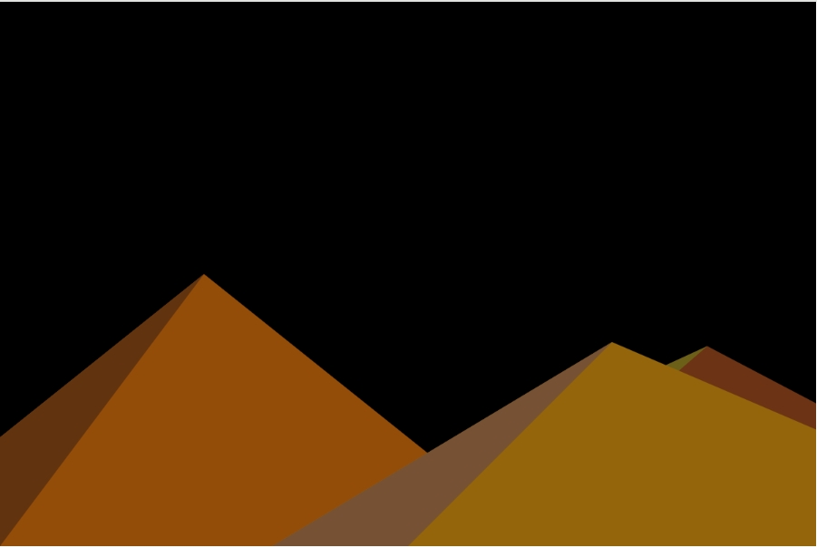

# wzha0973_9103_tut1_Quiz8

## **Bold Text** Part 1

### The sketch demonstrates autonomous motion of the sun, achieved by decrementing its vertical position during each execution of the 'draw()' function. This motion ceases when the conditional expression in the if statement evaluates to false, specifically when 'sunHeight' is less than or equal to 130.